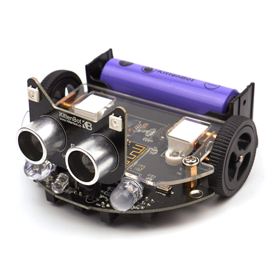

# MiniLFR

Microbit Makecode extension for Kittenbot MiniLFR



## License

MIT

## Supported targets

* for PXT/microbit
* for PXT/arcade
(The metadata above is needed for package search.)

```package
minilfr=github:Kittenbot/pxt-minilfr
```